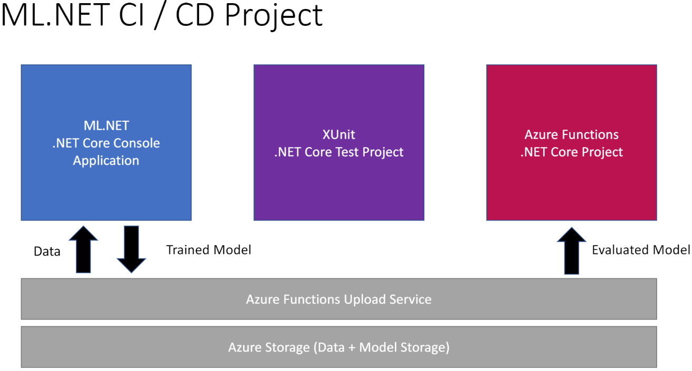

# ML.NET CI/CD MLOps Azure DevOps Sample

Sample ML.NET application that trains, evaluates and deploys a model using Azure DevOps. The model uses reviews from Yelp to train an binary classification model to analyze sentiment. The trained model is stored in an Azure Storage Blob container and used to make predictions over HTTP by an Azure Function.

## Prerequisites

- .NET SDK 3.1
- Azure Functions Core Tools

## The Application



- Domain: F# .NET Core Class Library containing schema of input and output data used by the model.
- TrainConsole: C# .NET Core Console Application. Trains a binary classification model to analyze sentiment.
- TestModel: C# XUnit Test Project. Used to evaluate the model.
- AzFnUploadService: C# Azure Functions HTTP Triggered serverless application that uploads the trained model to a validation / staging Azure Storage Blob container and the evaluated model to a production Azure Storage Blob container. 
- AzFnSentimentAnalysisService: C# Azure Functions HTTP Triggered serverless application that uses the production model to make predictions.
- azure-pipelines.yml: Contains Azure DevOps Build/Test/Deploy job definitions.

## Data

The data used in this application comes from the [Sentiment Labeled Sentences UCI repository](https://archive.ics.uci.edu/ml/datasets/Sentiment+Labelled+Sentences).

## Run the applications

Use the following steps to run the applications

### TrainConsole

1. Navigate to `TrainConsole` project directory.
1. Use .NET CLI and provide the URI of the dataset used for training as an argument. The URI can be hosted anywhere. For this application, it was hosted in an Azure Storage Blob container and anonymous read access was provided for the blob containing the data.

```dotnetcli
dotnet run <DATASET-URI>
```

### TestModel

1. Navigate to `TestModel` project directory.
1. Use the .NET CLI to run the following command:

```dotnetcli
dotnet test
```

### AzFnUploadService

1. Make sure you have in Azure Blob Storage, containers called *validation* and *production*.
1. Navigate to the `AzFnUploadService` project directory.
1. Create a `local.settings.json` file with the following content. Replace the `AZURE-BLOB-STORAGE-CONNECTION-STRING` with the URI of the blob account where you'll be saving your models to.

```json
{
  "IsEncrypted": false,
  "Values": {
    "AzureWebJobsStorage": "UseDevelopmentStorage=true",
    "FUNCTIONS_WORKER_RUNTIME": "dotnet",
    "AzModelStorageConnectionString": "<AZURE-BLOB-STORAGE-CONNECTION-STRING>"
  }
}
```
1. Use the Azure Functions Core Tools in the terminal to start the application:

```bash
func host start
```

1. In another terminal, navigate to the `TrainConsole` project directory.
1. Use `curl` in the terminal to upload the model. Make sure to replace `ENDPOINT` with `Validation` or `Production` depending which Azure Storage Blob Container you want to upload the model to.

```bash
curl --location --request POST http://localhost:7071/api/Upload<ENDPOINT> \
--form '=@model.zip'
```

You should receive the following response if the model was uploaded successfully:

```text
Uploaded Successfully
```

### AzFnSentimentAnalysisService

1. Navigate to the `AzFnSentimentAnalysisService` project directory. 
1. Create a `local.settings.json` file with the following content. Replace the `PRODUCTION-MODEL-URI` with the URI of the blob containing the production model. (Validation is also valid. This URI can point to any serialized version of the model)

```json
{
  "IsEncrypted": false,
  "Values": {
    "AzureWebJobsStorage": "UseDevelopmentStorage=true",
    "FUNCTIONS_WORKER_RUNTIME": "dotnet",
    "MODEL_URI": "<PRODUCTION-MODEL-URI>"
  }
}
```

1. Use the Azure Functions Core Tools in the terminal to start the application:

```bash
func host start
```

1. In another terminal, use `curl` to classify the sentiment of a comment.

```bash
curl --location --request POST 'http://localhost:7071/api/AnalyzeSentiment' \
--header 'Content-Type: application/json' \
--data-raw '{
	"Comment": "The steak was bad!"
}'
```

The response should look as follows:

```text
Negative
```

## Additional Resources

- [ML.NET Documentation](https://docs.microsoft.com/dotnet/machine-learning/)
- [ML.NET YouTube Playlist](https://www.youtube.com/watch?v=pxUzw6JyqcM&list=PL1rZQsJPBU2TwElfOzqOsUW1yuxKNA091)
- [ML.NET Samples](https://github.com/dotnet/machinelearning-samples)
- [ML.NET GitHub Repo](https://github.com/dotnet/machinelearning)
- [Azure DevOps](https://dev.azure.com)
- [Azure DevOps Documentation](https://docs.microsoft.com/azure/devops/?view=azure-devops)
- [Azure Functions Documentation](https://docs.microsoft.com/en-us/azure/azure-functions/)
- [.NET Documentation](https://docs.microsoft.com/en-us/dotnet/)
